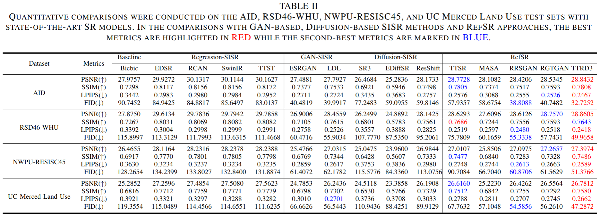

# TTRD3:Texture Transfer Residual Denoising Dual Diffusion Model 

## Abstract
> Remote Sensing Image Super-Resolution (RSISR) aims to reconstruct high-resolution (HR) remote sensing (RS) images from low-resolution (LR) RS images inputs by overcoming the physical limitations of imaging systems. As a specialized task in the RS domain, RSISR provides critical support for downstream fine-grained ground object interpretation. Traditional RSISR methods face three major technical shortcomings: First, since wide-area RS images exhibit highly complex ground object characteristics, it is challenging to extract effective multi-scale features for SR reconstruction from their blurred representations. Second, the inherent imaging constraints of RS images lead to insufficient prior information, resulting in poor semantic consistency between SR reconstructions and real scenes. Third, existing SR methods struggle to balance the inherent trade-off between geometric accuracy and visual quality. To address these challenges, this paper proposes Texture Transfer Residual Denoising Dual Diffusion Model (TTRD3), a diffusion model (DM)-based reference-based super-resolution (RefSR) framework. Specifically, the Multi-scale Feature Aggregation Block (MFAB) is designed to extract spatially heterogeneous features with scale variations through parallel heterogeneous convolutional kernels. The Sparse Texture Transfer Guidance (STTG) is developed to mine multi-scale sparse texture features from high-resolution reference (Ref) images of similar scenes. The Residual Denoising Dual Diffusion Model (RDDM) framework is constructed to synergistically optimize geometric accuracy and visual quality by integrating the deterministic modeling of residual diffusion with the diverse generation of noise diffusion. Experiments on multi-source RS datasets demonstrate that TTRD3 significantly outperforms existing state-of-the-art (SOTA) methods in both geometric accuracy and visual quality. Our code and model are available at https://github.com/LED-666/TTRD3
## Pre-requisites
- Python 3.10 on Ubuntu 22.04
- CUDA 11.8 and gcc 11.4 and corresponding supported pyTorch
- Python packages:
```
pip install -r ./codes/requirements.txt
```

## Train
- **Step I.** Enter directory:
```
cd ./codes/example/TTRD3
```
- **Step II.** Modify the dataroots for train and val based on your actual root in
  - `./codes/example/TTRD3/options/TTRD3.yml`
  - Note that if you follow the steps for data preprocess, then dataroots don't need moodification
- **Step III.** Start training:
```
sh train.sh
```
- **Optional.** Also, you can change other training configurations in `TTRD3.yml` for addtional experiments

## Test
- **Step I.** Enter directory:
```
cd ./codes/example/RGTGAN
```
- **Step II.** Modify `val.sh` and `val.py` based on your configurations
- **Step III.** Start Testing:
```
sh val.sh
```
- **Optional.** Note that the evaluation results in the paper are asseseed differently from the codes where only PSNR and SSIM scores are calculated. You should unify your evluation metrics calculation standards in your research

## Results
- AID test set:
<p align="center">
  

- RSD46-WHU、NWPU-RESISC45 and UCMerced_LandUse test set:
<p align="center">
  

- Comparison with SOTA Results
<p align="center">
  


## Acknowledgement
The code is based on [RDDM](https://github.com/nachifur/RDDM). We thank the authors for their excellent contributions.


## Contact
If you have any questions about our work, please contact [liyide23@mails.ucas.ac.cn](liyide23@mails.ucas.ac.cn).
